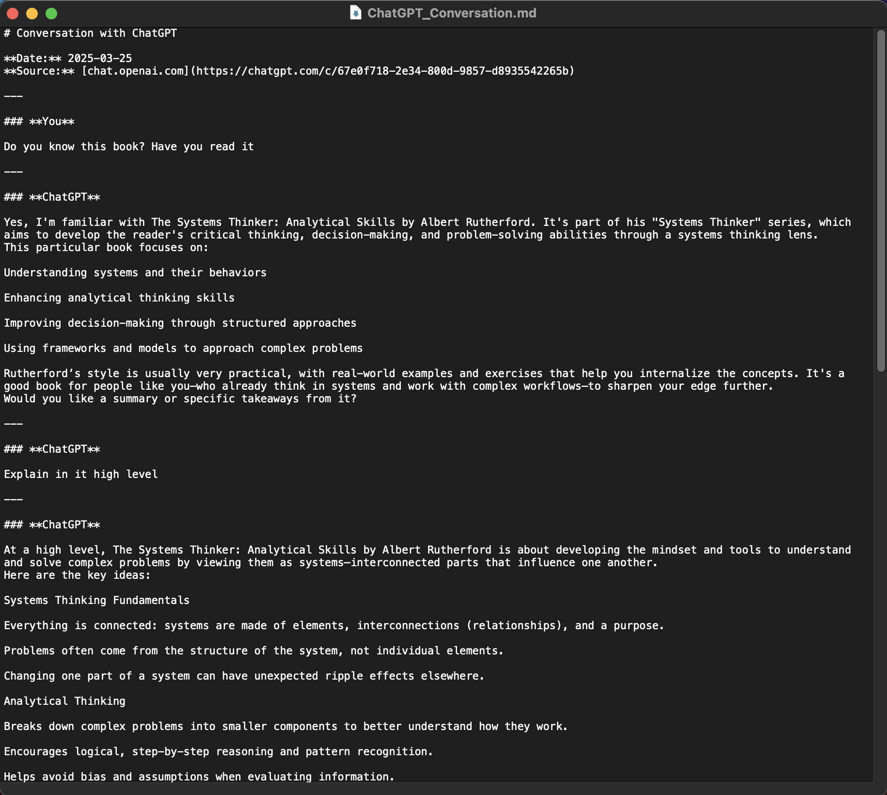
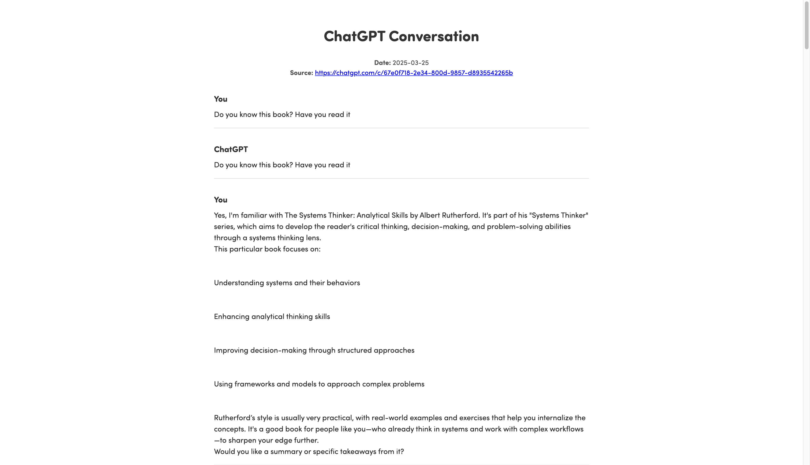

# ChatGPT Chat Exporter V.02 (DISCONTINUED)

Export your full ChatGPT conversations as clean, readable **Markdown** or **PDF** files — including all messages, sender labels, and code blocks.

---

## ✅ Features

- Captures **all messages**, not just yours
- Differentiates **actors** in the conversation
- Preserves **code blocks**, formatting, and structure
- Supports export as **Markdown** or **Printable PDF**
- Works directly from the browser — no install required

---

## 📦 How to Use

### Method 1: Console Method

If you prefer the manual method:

#### Export as Markdown
1. Open a conversation in ChatGPT
2. Open DevTools → Console
3. Paste contents of [ChatGPT Markdown Exporter](https://github.com/rashidazarang/chatgpt-chat-exporter/raw/master/exporter-markdown.js) 
4. Hit Enter — `.md` file will download

#### Export as PDF
1. Same as above — paste [ChatGPT PDF Exporter](https://github.com/rashidazarang/chatgpt-chat-exporter/raw/master/exporter-pdf.js) 
2. A printable tab opens with full conversation
3. Click **Save as PDF**

### Method 2: Install as Userscript (Recommended)

This is the safest and most convenient method:

1. Install a userscript manager extension in your browser:
   - [Tampermonkey](https://www.tampermonkey.net/) (Chrome, Firefox, Safari, etc.)
   - [Violentmonkey](https://violentmonkey.github.io/) (Chrome, Firefox)
   - [Greasemonkey](https://addons.mozilla.org/en-US/firefox/addon/greasemonkey/) (Firefox)

2. Click one of these links to install the userscript:
   
   **From GreasyFork (Recommended):**
   - [Install Markdown Exporter from GreasyFork](https://greasyfork.org/en/scripts/530789-chatgpt-chat-exporter-markdown)
   - [Install PDF Exporter from GreasyFork](https://greasyfork.org/en/scripts/530790-chatgpt-chat-exporter-pdf)
   
   **Directly from GitHub:**
   - [Install Markdown Exporter](https://github.com/rashidazarang/chatgpt-chat-exporter/raw/master/chatgpt-markdown-exporter.user.js)
   - [Install PDF Exporter](https://github.com/rashidazarang/chatgpt-chat-exporter/raw/master/chatgpt-pdf-exporter.user.js)

3. Open ChatGPT and click the "Export as Markdown" or "Export as PDF" button that appears in the sidebar.

---

## 🖼️ Demo

| Markdown Output | PDF View |
|-----------------|----------|
|  |  |

---

## 🧩 Customize

Want to:
- Change "You" to your name?
- Add timestamps?
- Export as JSON?

Feel free to fork and tweak — or open an issue and suggest it!

---

## 🛠️ Contributing

PRs and suggestions welcome — especially for more export formats (HTML, TXT, EPUB).

See [CONTRIBUTING.md](CONTRIBUTING.md) for details on how to contribute.

---

## 📜 License

[MIT](LICENSE)
