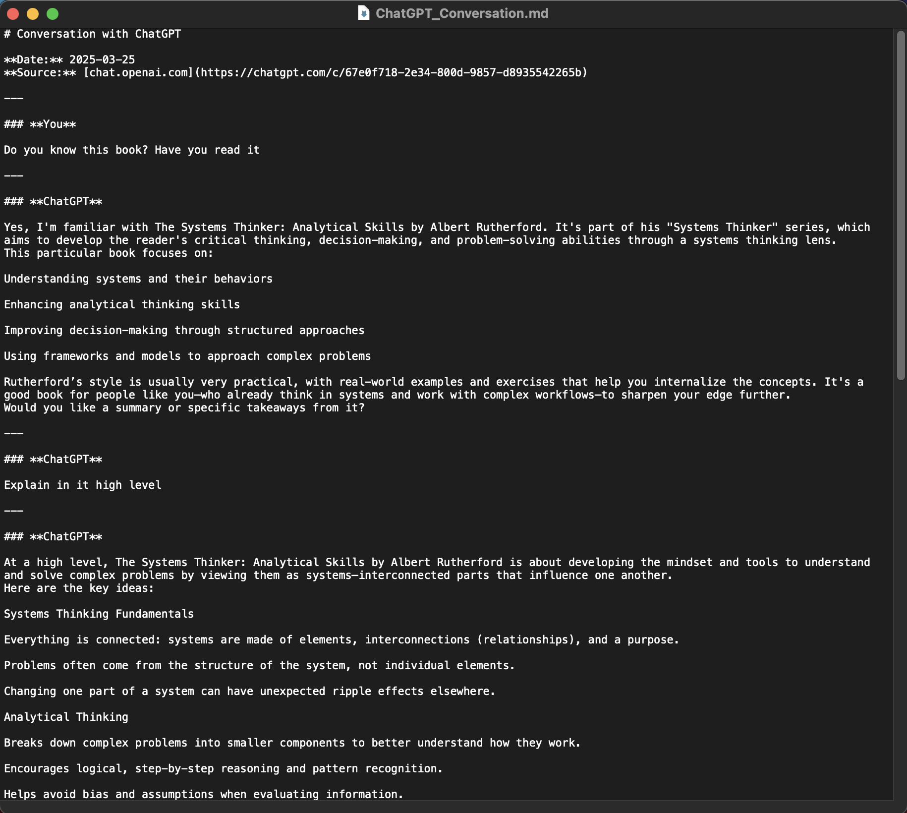
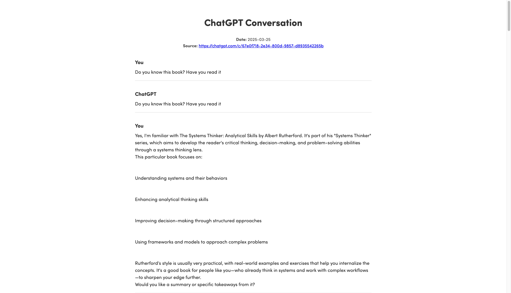

# ChatGPT Chat Exporter

[](https://github.com/rashidazarang/chatgpt-chat-exporter/releases)
[](LICENSE)
[](https://github.com/rashidazarang/chatgpt-chat-exporter/actions/workflows/ci.yml)

Export your **ChatGPT** and **Google Gemini** conversations as clean, readable **Markdown**, **HTML**, or **print-ready PDF** files — with faithful sender labels, code blocks, tables, math, and formatting.

No install, no server, no account: everything runs locally in your browser.


---

## ✅ Features

- 📝 Captures **all messages** with proper sender attribution
- 🔤 **Faithful text**: prompt line breaks, indentation, and backslashes are preserved exactly as written — no re-flowed whitespace, no doubled `\` escapes
- 🔧 Preserves **code blocks** (including CodeMirror), tables, MathJax/KaTeX equations, lists, links, media placeholders, and file/artifact cards
- 📄 Exports to **Markdown**, **HTML**, or **printable PDF**
- 🆕 **Google Gemini** conversation export support
- 🔒 **Private by default**: exports show the provider label without embedding your exact conversation URL
- 🚀 Works directly from the browser console — or install as a one-click userscript
- 🛡️ One shared, tested extraction engine powers every exporter, with multiple selector fallbacks to survive UI changes

---

## 📦 How to Use

### Method 1: Install as Userscript (Recommended)

1. Install a userscript manager:
   - [Tampermonkey](https://www.tampermonkey.net/) (Chrome, Firefox, Safari, Edge)
   - [Violentmonkey](https://violentmonkey.github.io/) (Chrome, Firefox)
   - [Greasemonkey](https://addons.mozilla.org/en-US/firefox/addon/greasemonkey/) (Firefox)

2. Install the script:

   **From GreasyFork (Recommended):**
   - [Markdown Exporter](https://greasyfork.org/en/scripts/530789-chatgpt-chat-exporter-markdown)
   - [PDF Exporter](https://greasyfork.org/en/scripts/530790-chatgpt-chat-exporter-pdf)

   **Directly from GitHub:**
   - [Markdown Exporter](https://github.com/rashidazarang/chatgpt-chat-exporter/raw/master/chatgpt-markdown-exporter.user.js)
   - [PDF Exporter](https://github.com/rashidazarang/chatgpt-chat-exporter/raw/master/chatgpt-pdf-exporter.user.js)

3. Open ChatGPT and click the **Export as Markdown** or **Export as PDF** button that appears in the corner of the page.

### Method 2: Browser Console

1. Open a conversation in ChatGPT
2. Open DevTools → Console (`F12` or `Cmd+Option+J`)
3. Paste the contents of the exporter you want and press Enter:
   - **Markdown (.md):** [exporter-markdown.js](https://github.com/rashidazarang/chatgpt-chat-exporter/raw/master/exporter-markdown.js)
   - **HTML (.html):** [exporter-html.js](https://github.com/rashidazarang/chatgpt-chat-exporter/raw/master/exporter-html.js)
   - **PDF (print-ready HTML):** [exporter-pdf.js](https://github.com/rashidazarang/chatgpt-chat-exporter/raw/master/exporter-pdf.js)
4. The file downloads automatically, named after your conversation title

### Google Gemini

1. Open your conversation at [gemini.google.com](https://gemini.google.com)
2. Open DevTools → Console (`F12`)
3. Paste the contents of [gemini-exporter-markdown.js](https://github.com/rashidazarang/chatgpt-chat-exporter/raw/master/gemini-exporter-markdown.js) and press Enter

---

## 🖼️ Demo

| Markdown Output | PDF View |
|-----------------|----------|
|  |  |

---

## 🔧 What's New in v0.7.2

**Markdown Fidelity Fixes** (thanks [@kbelleau23-byte](https://github.com/kbelleau23-byte) for the detailed report and test case in [#25](https://github.com/rashidazarang/chatgpt-chat-exporter/issues/25)):

- 🔤 **Prompt whitespace preserved**: user messages rendered with `white-space: pre-wrap` keep their line breaks, blank lines, and indentation instead of being collapsed onto one line
- ➖ **No more doubled backslashes**: inline code and table cells keep `\n`, `C:\path`, and other backslash sequences verbatim (backslash escapes are never processed inside code spans, so escaping them only corrupted the output)
- 🧵 **Code block line breaks**: code lines separated by element boundaries or `<br>` tags no longer run together (`Line 1Line 2…`) — extraction no longer trusts `innerText` on detached nodes
- 💠 **Correct backtick handling**: inline code containing backticks now uses longer CommonMark delimiters (`` ``a`b`` ``) instead of invalid `\`` escapes
- 📚 **Nested lists indent properly** and ordered-list continuation lines align with their markers
- 🔣 **Entity-safe text**: conversations that literally discuss `&amp;`-style HTML entities are no longer silently un-escaped
- 🛡️ **Hardening**: randomized internal placeholders (no marker collisions/injection), URL escaping for spaces and parentheses in links, safer filenames, and delayed `revokeObjectURL` so downloads can't be aborted in Firefox-based browsers

<details>
<summary>📝 Previous updates</summary>

### v0.7.1

**Security and Privacy Fixes:**
- 🔒 **Private Source Metadata by Default**: Markdown, HTML, and PDF-ready exports now show the provider label without embedding the exact conversation URL unless `includeSourceUrl: true` is explicitly used.
- 🧱 **Safe Markdown Code Fences**: Code blocks now choose a fence longer than any backtick run in the exported code, preventing premature fence closure when conversations contain triple backticks.
- 🧪 **Regression Coverage**: Tests cover source URL omission, explicit source URL opt-in, and Markdown fence-injection cases across generated exporters.

### v0.7.0

**Live Compatibility Rewrite:**
- 🧭 **Shared Extraction Engine**: ChatGPT console scripts, Gemini console script, and userscripts now embed one canonical extraction engine generated from `src/extraction-engine.js`
- 🧱 **Provider Adapters**: ChatGPT uses `data-message-author-role` first; Gemini uses current `user-query` / `model-response` custom elements first
- 🧩 **Modern Rich Content**: Handles CodeMirror, custom `code-block`, tables, links/citations, MathJax/KaTeX/TeX annotations, media placeholders, and basic file/artifact cards
- 🧪 **Expanded Synthetic Fixtures**: Tests cover live-observed ChatGPT and Gemini DOM shapes without including private authenticated captures

### v0.6.0

- 🧱 **Modern ChatGPT Code Blocks**: Supports CodeMirror-based code blocks used by current `chatgpt.com`
- ∑ **MathJax/KaTeX Support**: Exports equations as inline `$...$` or block `$$...$$` Markdown
- 📊 **Table Export**: Converts rendered tables into Markdown tables and keeps tables in HTML/PDF exports
- ✨ **Gemini Refresh**: Updated Gemini selectors and rich-content handling

### v0.5.0

- 🎯 **Smart File Naming**: Exported files use conversation titles instead of generic names
- 📄 **True PDF Support**: PDF exporter creates print-optimized HTML that converts perfectly to PDF
- 🔍 **Better Message Detection**: Improved selectors to prevent duplicate messages
- 🛡️ **CSP Compliant**: All exporters work within ChatGPT's security restrictions

### v0.4.0

- 🆕 **Google Gemini Support**: Full conversation export for Gemini
- 🔧 **Unified Codebase**: Shared logic and improvements across platforms

</details>

---

## 🏗️ How It Works

All exporters are generated from a single, tested engine:

```
src/extraction-engine.js     ← canonical source (edit this)
scripts/build-exporters.js   ← generates the files below
├── exporter-markdown.js         ChatGPT → Markdown (console)
├── exporter-html.js             ChatGPT → HTML (console)
├── exporter-pdf.js              ChatGPT → print-ready HTML (console)
├── gemini-exporter-markdown.js  Gemini → Markdown (console)
├── chatgpt-markdown-exporter.user.js   userscript + export button
└── chatgpt-pdf-exporter.user.js        userscript + export button
```

The engine finds messages through a cascade of selector strategies (data attributes → ARIA → semantic HTML → content heuristics), so it keeps working across ChatGPT and Gemini UI revisions. Rich content — code, tables, math, links, media — is converted through a processing pipeline that protects verbatim regions (code, pre-wrap prompts) from whitespace cleanup.

## 🧑‍💻 Development

```bash
npm install     # dev dependency: jsdom (tests only)
npm run build   # regenerate all exporters from src/extraction-engine.js
npm test        # verify generated files are current + run the jsdom test suite
```

Never edit the generated exporter files directly — change `src/extraction-engine.js` (or the build script) and run `npm run build`.

See [CONTRIBUTING.md](CONTRIBUTING.md) and [EXPORTER_GUIDE.md](EXPORTER_GUIDE.md) for details.

## 🔐 Privacy & Security

- Everything runs **locally in your browser**; no data leaves your machine
- Exports **omit your exact conversation URL** by default (the engine supports `includeSourceUrl: true` for explicit opt-in)
- HTML/PDF output escapes all conversation content; unsafe link schemes (`javascript:`, `data:`) are never exported as links

## ❓ Troubleshooting

- **"No messages found"** — the site's DOM may have changed. Update to the latest exporter version; if it persists, [open an issue](https://github.com/rashidazarang/chatgpt-chat-exporter/issues) with your browser and a description of the page.
- **Export button doesn't appear** — confirm the userscript is enabled for `chatgpt.com` and reload the page.
- **Downloads blocked in the console** — some browsers require you to allow downloads/popups triggered from DevTools; the userscript method avoids this.

---

## 🚀 Version History

- **v0.7.2** (Current) - Markdown fidelity: preserved prompt whitespace, no doubled backslashes, correct code-span/list/entity handling (#25)
- **v0.7.1** - Source URL privacy by default and safe Markdown code fences
- **v0.7.0** - Shared extraction engine, live compatibility audit, current ChatGPT/Gemini provider adapters
- **v0.6.0** - Modern ChatGPT code blocks, MathJax/KaTeX, tables, Gemini refresh
- **v0.5.0** - Smart file naming, true PDF support, improved duplicate detection
- **v0.4.0** - Added Google Gemini support, multi-platform architecture
- **v0.3.0** - Major ChatGPT stability fixes, modern selectors, duplicate prevention
- **v0.2.0** (Archived) - Original ChatGPT working version

---

## 📜 License

[MIT](LICENSE)
