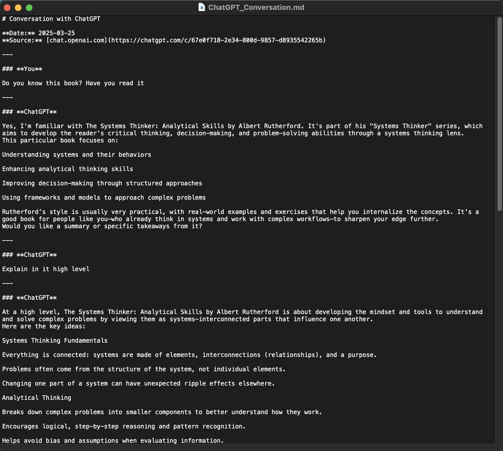
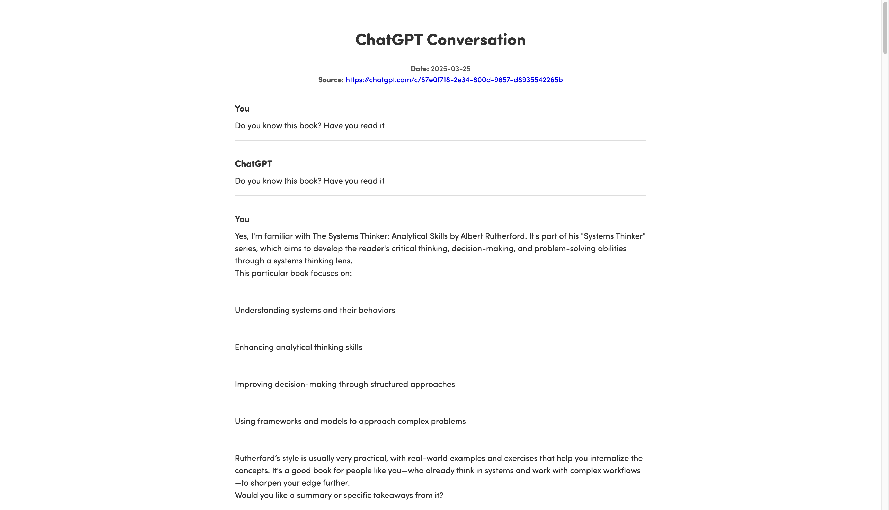

# ChatGPT Chat Exporter

[](https://github.com/rashidazarang/chatgpt-chat-exporter/releases)
[](LICENSE)
[](https://github.com/rashidazarang/chatgpt-chat-exporter/actions/workflows/ci.yml)

Export your **ChatGPT** and **Google Gemini** conversations as clean, readable **Markdown**, **HTML**, or **print-ready PDF** files — with faithful sender labels, code blocks, tables, math, and formatting.

No install, no server, no account: everything runs locally in your browser.


---

## ✅ Features

- 📝 Captures **all messages** with proper sender attribution
- 📜 **Long conversations export fully**: the exporter auto-scrolls through virtualized (lazy-loaded) conversations so messages ChatGPT removed from the page are still captured
- 🔗 **Web-search references included**: citation sources in a response are appended as a numbered **References** list, matching ChatGPT's own copy output
- 🖼️ **Images are kept**: image-only turns are captured and images are embedded directly in Markdown, HTML, and PDF-ready exports when their bytes are available
- 🕓 **Per-turn context included**: ChatGPT timestamps, uploaded/generated file references, download paths, and visible reasoning recaps are preserved when available
- 🔤 **Faithful text**: prompt line breaks, indentation, and backslashes are preserved exactly as written — no re-flowed whitespace, no doubled `\` escapes
- 🔧 Preserves **code blocks** (including CodeMirror), tables, MathJax/KaTeX equations, lists, links, media, and file/artifact cards
- 📄 Exports to **Markdown**, **HTML**, or **printable PDF**
- 🆕 **Google Gemini** conversation export support
- 🔒 **Private by default**: exports show the provider label without embedding your exact conversation URL
- 🧩 Integrates with ChatGPT's native conversation and Share menus — and falls back to a floating **Export** button when your account has no Share control (e.g. enterprise policies)
- 🚀 Works directly from the browser console — or install as a userscript
- 🛡️ One shared, tested extraction engine powers every exporter, with multiple selector fallbacks to survive UI changes

---

## 📦 How to Use

### Method 1: Install as Userscript (Recommended)

1. Install a userscript manager:
   - [Tampermonkey](https://www.tampermonkey.net/) (Chrome, Firefox, Safari, Edge)
   - [Violentmonkey](https://violentmonkey.github.io/) (Chrome, Firefox)
   - [Greasemonkey](https://addons.mozilla.org/en-US/firefox/addon/greasemonkey/) (Firefox)

2. Install either userscript. Both installers expose Markdown and PDF export actions, so existing installations keep working without needing both scripts:

   **From GreasyFork (Recommended):**
   - [Markdown Exporter](https://greasyfork.org/en/scripts/530789-chatgpt-chat-exporter-markdown)
   - [PDF Exporter](https://greasyfork.org/en/scripts/530790-chatgpt-chat-exporter-pdf)

   **Directly from GitHub:**
   - [Markdown Exporter](https://github.com/rashidazarang/chatgpt-chat-exporter/raw/master/chatgpt-markdown-exporter.user.js)
   - [PDF Exporter](https://github.com/rashidazarang/chatgpt-chat-exporter/raw/master/chatgpt-pdf-exporter.user.js)

3. Open a ChatGPT conversation, then either:
   - Open the conversation's **•••** menu and choose **Export to Markdown** or **Export to PDF**.
   - Click the header **Share** button and choose **Share…**, **Copy link**, **Export to Markdown**, or **Export to PDF**.
   - If your account has no Share control at all (sharing disabled by an enterprise policy, for example), a floating **Export** button appears in the bottom-right corner with the same options.

### Method 2: Browser Console

1. Open a conversation in ChatGPT
2. Open DevTools → Console (`F12` or `Cmd+Option+J`)
3. Paste the contents of the exporter you want and press Enter:
   - **Markdown (.md):** [exporter-markdown.js](https://github.com/rashidazarang/chatgpt-chat-exporter/raw/master/exporter-markdown.js)
   - **HTML (.html):** [exporter-html.js](https://github.com/rashidazarang/chatgpt-chat-exporter/raw/master/exporter-html.js)
   - **PDF (print-ready HTML):** [exporter-pdf.js](https://github.com/rashidazarang/chatgpt-chat-exporter/raw/master/exporter-pdf.js)
4. The file downloads automatically, named after your conversation title

### Google Gemini

1. Open your conversation at [gemini.google.com](https://gemini.google.com)
2. Open DevTools → Console (`F12`)
3. Paste the contents of [gemini-exporter-markdown.js](https://github.com/rashidazarang/chatgpt-chat-exporter/raw/master/gemini-exporter-markdown.js) and press Enter

---

## 🖼️ Demo

| Markdown Output | PDF View |
|-----------------|----------|
|  |  |

---

## 🔧 What's New in v0.10.0

- 📊 **Exports now show their work.** A small card appears over the conversation while the export runs — phase, progress bar, how many messages and lines have been read, and a preview of the message it just captured. A long export no longer looks like a frozen tab. ([release notes](temporal/release-notes-v0.10.0.md))
- 🟠 **An incomplete export doesn't end on a green bar**: if the sweep finishes short of the count ChatGPT's own payload reports, the card turns amber and says how many messages never loaded. It also tells you when a background tab has paused it.
- 🧷 **Built so it can't break anything**: no `innerHTML` (Trusted Types safe), it can never be captured into your export, it never intercepts a click, and a progress card that fails to draw costs you a progress bar rather than your file.
- ▶️ **Still one paste** — nothing about running an export changes.

<details>
<summary>📝 Previous updates</summary>

### v0.9.8

- ⏸️ **A background tab no longer eats your export budget.** The sweep waited for a hidden tab *on its own clock*, so a backgrounded tab burned the whole time limit doing nothing and saved a fragment. Worse, raising the limit to help a long conversation only bought a longer stall. The wait now has its own budget and gives the time back. ([release notes](temporal/release-notes-v0.9.8.md))
- 📣 **Long exports report progress** every 5 seconds instead of going silent for minutes — silence is indistinguishable from a hang.

### v0.9.7

- ⚡ **Exports are about 4× faster.** The sweep slept a fixed 350ms per scroll step whether or not the page had finished rendering — on a long conversation that timer *was* the export. It now watches the DOM and continues the moment it settles, capped at the old delay, so it can only be faster and never less thorough. Measured 11086ms → 2848ms on a 40-message fixture, byte-identical output. ([release notes](temporal/release-notes-v0.9.7.md))
- 🎯 **One loop deliberately still waits**: pinning to the top of a conversation waits on a *network* fetch of older history, which produces no DOM activity until it arrives. Speeding that up would start the sweep below the real top and drop your oldest messages.
- 🔕 **Budget warning rebalanced** to match the new speed — a long conversation that now finishes comfortably is no longer flagged.

### v0.9.6

- 📏 **A short export no longer claims to be complete**: the old check could pass while the sweep quietly stopped before the top of a long conversation. The export now compares against the message count ChatGPT's own payload reports — ground truth instead of a heuristic. ([release notes](temporal/release-notes-v0.9.6.md))
- ⏱️ **Long conversations warn you *before* you export**: a 129,522px conversation needs ~184 scroll steps and can't finish inside the default 120s budget. `selector-doctor.js` now measures that from the page and tells you the `maxDuration` to pass.
- 🔕 **Fewer, better warnings**: two that fired on perfectly healthy pages were demoted to informational notes. A warning list that cries wolf stops being read.

### v0.9.5

- 🏷️ **A Gemini chat could export titled "Flash-Lite"** — the model name, not the conversation. Gemini renders its model picker under a class matching one of its own title selectors, and it outranked the tab title. That selector is removed, and Gemini now trusts the tab title, which is verified accurate. Found on the first real run of v0.9.4's own health check. ([release notes](temporal/release-notes-v0.9.5.md))
- 🩺 **`selector-doctor.js` now catches this whole class of bug**: it warns when a title selector matched something the browser tab disagrees with — "one of them is page chrome."
- 🔍 **Lesson recorded in the repo docs**: page chrome mounts *after* first paint, so a single point-in-time probe is not evidence that a selector is safe. v0.9.4 shipped on exactly that mistake.

### v0.9.4

Hardening pass over the provider layer — both ChatGPT and Gemini read against the live sites. ([release notes](temporal/release-notes-v0.9.4.md))

- 🏷️ **Gemini exports no longer carry Google's tab suffix**: every Gemini title selector misses on the live site, so the title came from the tab — including its `" - Google Gemini"` ending, which landed in the exported heading *and* the download filename.
- 🧩 **A "turn" is now a per-provider concept**: the wrapper that owns a message was hardcoded to ChatGPT's, so the v0.9.2 fix for media rendered *beside* a message could never apply to Gemini. Gemini's own pair wrapper holds a question **and** its answer — adopting it would have prefixed every answer with its question, so Gemini's turn is correctly its message element. Pinned by a regression test.
- 🩺 **New `selector-doctor.js`**: paste it into the console on either provider and it reports what each shipped selector actually matches, which one is carrying the page, and whether ChatGPT's private API authenticates. It warns when a cascade is still working but only on a fallback — what silent drift looks like one release before it breaks.
- 🕓 **Worth knowing:** neither site exposes per-message timestamps in the DOM. ChatGPT's come from the conversation payload — so the v0.9.3 bug meant **every export before it shipped with no timestamps at all**.

### v0.9.3

- 🔑 **`404 (Not Found)` on `backend-api/conversation/…` is fixed**: chatgpt.com's private API doesn't accept cookies alone — it wants the same bearer token the app itself uses — and it reports a request without one as a **404**, not a 401. v0.9.2 only retried with the token after a 401/403, so the retry never ran: every export silently lost its metadata pass and left a red error in the console. The token is now read up front and attached to every request, so the failing call isn't made at all. ([release notes](temporal/release-notes-v0.9.3.md))
- 🏢 **Team/Business/Enterprise conversations**: a refused read now retries as each workspace you can act as, which a workspace-owned conversation requires.
- 🖼️ **Attachment images can actually be embedded**: the file endpoint was the one private-API call sending no credentials at all, and it reports failure as HTTP **200** with an error body — both now handled.
- 🔒 **Your session can't follow a download link off-origin**: signed file links point at a third-party CDN, so credentials are attached only on a same-origin hop.
- 💬 **A skipped metadata pass explains itself** — which cause, and that the conversation itself exported fine — instead of leaving you a bare network error.

### v0.9.2

- 🖼️ **Image-only messages no longer disappear** ([#33](https://github.com/rashidazarang/chatgpt-chat-exporter/issues/33)): attachment media can live beside ChatGPT's otherwise empty role node. The exporter now reads the whole turn, embeds safe raster image data when possible, and falls back to the source image or an explicit placeholder instead of reporting the turn as unread.
- 🕓 **Transcript context is preserved** ([#32](https://github.com/rashidazarang/chatgpt-chat-exporter/issues/32)): per-message timestamps, uploaded filenames, generated `sandbox:/mnt/data` downloads, and visible reasoning recaps are included when ChatGPT exposes them.
- 📎 **Button-backed file cards keep their labels and links**: file controls are serialized before generic interface buttons are stripped.
- 🛟 **Metadata remains best-effort**: the normal DOM export still completes if ChatGPT's authenticated conversation or file endpoint is unavailable or changes.

### v0.9.1

- ✍️ **Exporting mid-answer waits for the answer to finish**: hit Export while ChatGPT is still writing and the file used to contain the reply cut off mid-sentence, with nothing to say so. The sweep now waits for the newest message to stop growing (bounded by the same deadline), and marks the export incomplete if it can't.
- 🧪 **Gemini's auto-scroll path is now tested** — it has shipped since v0.8.0 with no coverage of its custom-element markup.

### v0.9.0

**An audit pass over the whole engine** (see [release notes](temporal/release-notes-v0.9.0.md)). Two of these were silent data loss:

- 🧬 **Messages sharing a long opening are no longer collapsed** (critical): deduplication keyed on the first 160 characters, so a conversation of redrafts — every answer opening with the same letterhead or preamble — lost all but the first, without a word. Messages are now keyed by a hash of their whole text.
- 📣 **Truncated exports say so**: a sweep that couldn't read every turn used to save a short file that looked complete. The export now reports `complete` / `missedMessages` and puts a dialog in front of you.
- ⏱️ **An export can't hang the page**: the sweep runs against a wall-clock budget (`maxDuration`, default 120s) instead of an unbounded step count.
- 🙈 **A backgrounded tab is waited for**, not fought — the sweep pauses while the tab is hidden and resumes when it returns (v0.8.3 only warned).
- ↩️ **Your scroll position always comes back**, even if the sweep throws midway; a container that disappears mid-sweep is re-resolved.
- ⏳ The launcher shows **Exporting…** while a sweep runs, and a second click won't start a competing one.

### v0.8.3

**Follow-up fixes from live testing** (see [release notes](temporal/release-notes-v0.8.3.md)):

- ⏳ **Turns caught mid-render are no longer dropped**: ChatGPT mounts a turn before its text renders, and the sweep was retiring those turns before it managed to read them. It now retries them in place, and only marks a turn done once it has actually been captured.
- 🙈 **Hidden-tab warning**: Chrome throttles timers and suspends rendering in a background tab, which truncates exports. Starting an export on a hidden tab now warns you to bring it to the front.

### v0.8.2

**Fixes found by testing against a live ChatGPT conversation** — each one ships with a regression test that fails on v0.8.1:

- 🔢 **Long exports were out of order** (critical): the auto-scroll sweep appended messages as it captured them, so a 12-turn conversation exported from the bottom came out as turns `1, 2, 8, 9, 10, 11, 12, 3, 4, 5, 6, 7` — ChatGPT hadn't unmounted the bottom turns yet when the sweep jumped to the top. Messages now carry their offset in the conversation and are sorted into reading order.
- ✂️ **Sweeps could stop after the first screenful**: a virtualizer swapping turns for placeholders can drag `scrollTop` backwards, which the old loop read as "reached the bottom" and exported a fragment. Progress is now judged by messages captured and by actually reaching the end.
- 🧩 **Export entries never appeared in the ••• menu on desktop**: ChatGPT hides that menu's Share row (`sm:hidden`) when the header Share button is present, and the entries were cloned from it. They now clone a row that actually renders.
- 🔗 **"Share prompt" on a message stays native**: per-message share buttons were being intercepted by the export menu.
- 📋 **Sidebar conversation menus are left alone** — they belong to other chats, but an export always reads the open one.

### v0.8.1

**The Export UI No Longer Depends on ChatGPT's Share Button** ([#31](https://github.com/rashidazarang/chatgpt-chat-exporter/issues/31), thanks [@n8henrie](https://github.com/n8henrie)):

- 🎯 **Floating Export button is back — as a fallback**: v0.8.0 moved exports into ChatGPT's native menus, which left accounts with sharing disabled (enterprise policies) with no export control at all. A floating **Export** button now appears whenever no Share control exists on the page, and steps aside automatically when one does.
- 🧯 **Console escape hatch**: the userscript exposes `ChatExporter.markdown()`, `ChatExporter.pdf()`, and `ChatExporter.showLauncher()` so an export is always reachable, whatever ChatGPT's UI does next.
- 🛡️ **Strict-CSP safe**: the UI builds its icons and menu items through DOM APIs instead of `innerHTML`, so pages that enforce Trusted Types can't block it. No shipped code touches an HTML injection sink — covered by a regression test.
- 🌍 **Localized menus labelled correctly**: export entries cloned into a non-English **•••** menu now get their own label instead of repeating ChatGPT's.
- 🧹 Cloned menu entries no longer carry ChatGPT's own `data-testid`s, so its internal queries never pick up our copies.

### v0.8.0

**Full Captures for Long Conversations** ([#28](https://github.com/rashidazarang/chatgpt-chat-exporter/issues/28), [#29](https://github.com/rashidazarang/chatgpt-chat-exporter/issues/29)):

- 📜 **Lazy-loading handled**: ChatGPT virtualizes long conversations — messages scrolled out of view are removed from the DOM, so a single DOM pass could only ever export a fragment. The engine now auto-scrolls the conversation container from top to bottom, serializing each message while it exists, then restores your scroll position. Manual pre-scrolling is no longer needed (and never worked, since the DOM forgets what you scrolled past).
- 🔗 **References exported** ([#27](https://github.com/rashidazarang/chatgpt-chat-exporter/issues/27)): web-search citations in a response (recognized by their `utm_source=chatgpt.com` links or citation containers) are appended to that message as a numbered **References** list in Markdown, HTML, and PDF exports.
- 🧩 **Native menu polish**: the header Share menu now includes a **Share…** item that opens ChatGPT's real share dialog, and share controls are recognized by `data-testid` so the integration works on non-English ChatGPT locales.

### v0.7.2

**Markdown Fidelity Fixes** (thanks [@kbelleau23-byte](https://github.com/kbelleau23-byte) for the detailed report and test case in [#25](https://github.com/rashidazarang/chatgpt-chat-exporter/issues/25)):

- 🔤 **Prompt whitespace preserved**: user messages rendered with `white-space: pre-wrap` keep their line breaks, blank lines, and indentation instead of being collapsed onto one line
- ➖ **No more doubled backslashes**: inline code and table cells keep `\n`, `C:\path`, and other backslash sequences verbatim (backslash escapes are never processed inside code spans, so escaping them only corrupted the output)
- 🧵 **Code block line breaks**: code lines separated by element boundaries or `<br>` tags no longer run together (`Line 1Line 2…`) — extraction no longer trusts `innerText` on detached nodes
- 💠 **Correct backtick handling**: inline code containing backticks now uses longer CommonMark delimiters (`` ``a`b`` ``) instead of invalid `\`` escapes
- 📚 **Nested lists indent properly** and ordered-list continuation lines align with their markers
- 🔣 **Entity-safe text**: conversations that literally discuss `&amp;`-style HTML entities are no longer silently un-escaped
- 🛡️ **Hardening**: randomized internal placeholders (no marker collisions/injection), URL escaping for spaces and parentheses in links, safer filenames, and delayed `revokeObjectURL` so downloads can't be aborted in Firefox-based browsers

### v0.7.1

**Security and Privacy Fixes:**
- 🔒 **Private Source Metadata by Default**: Markdown, HTML, and PDF-ready exports now show the provider label without embedding the exact conversation URL unless `includeSourceUrl: true` is explicitly used.
- 🧱 **Safe Markdown Code Fences**: Code blocks now choose a fence longer than any backtick run in the exported code, preventing premature fence closure when conversations contain triple backticks.
- 🧪 **Regression Coverage**: Tests cover source URL omission, explicit source URL opt-in, and Markdown fence-injection cases across generated exporters.

### v0.7.0

**Live Compatibility Rewrite:**
- 🧭 **Shared Extraction Engine**: ChatGPT console scripts, Gemini console script, and userscripts now embed one canonical extraction engine generated from `src/extraction-engine.js`
- 🧱 **Provider Adapters**: ChatGPT uses `data-message-author-role` first; Gemini uses current `user-query` / `model-response` custom elements first
- 🧩 **Modern Rich Content**: Handles CodeMirror, custom `code-block`, tables, links/citations, MathJax/KaTeX/TeX annotations, media placeholders, and basic file/artifact cards
- 🧪 **Expanded Synthetic Fixtures**: Tests cover live-observed ChatGPT and Gemini DOM shapes without including private authenticated captures

### v0.6.0

- 🧱 **Modern ChatGPT Code Blocks**: Supports CodeMirror-based code blocks used by current `chatgpt.com`
- ∑ **MathJax/KaTeX Support**: Exports equations as inline `$...$` or block `$$...$$` Markdown
- 📊 **Table Export**: Converts rendered tables into Markdown tables and keeps tables in HTML/PDF exports
- ✨ **Gemini Refresh**: Updated Gemini selectors and rich-content handling

### v0.5.0

- 🎯 **Smart File Naming**: Exported files use conversation titles instead of generic names
- 📄 **True PDF Support**: PDF exporter creates print-optimized HTML that converts perfectly to PDF
- 🔍 **Better Message Detection**: Improved selectors to prevent duplicate messages
- 🛡️ **CSP Compliant**: All exporters work within ChatGPT's security restrictions

### v0.4.0

- 🆕 **Google Gemini Support**: Full conversation export for Gemini
- 🔧 **Unified Codebase**: Shared logic and improvements across platforms

</details>

---

## 🏗️ How It Works

All exporters are generated from a single, tested engine:

```
src/extraction-engine.js     ← canonical source (edit this)
src/userscript-ui.js         ← native ChatGPT menu integration
scripts/build-exporters.js   ← generates the files below
├── exporter-markdown.js         ChatGPT → Markdown (console)
├── exporter-html.js             ChatGPT → HTML (console)
├── exporter-pdf.js              ChatGPT → print-ready HTML (console)
├── gemini-exporter-markdown.js  Gemini → Markdown (console)
├── chatgpt-markdown-exporter.user.js   userscript + native export menus
└── chatgpt-pdf-exporter.user.js        userscript + native export menus
```

The engine finds messages through a cascade of selector strategies (data attributes → ARIA → semantic HTML → content heuristics), so it keeps working across ChatGPT and Gemini UI revisions. Rich content — code, tables, math, links, media — is converted through a processing pipeline that protects verbatim regions (code, pre-wrap prompts) from whitespace cleanup. On ChatGPT, the async exporter also makes a bounded, best-effort request for the already-open conversation's metadata and attachment bytes so it can add timestamps and embed images; the DOM capture remains the fallback.

## 🧑‍💻 Development

```bash
npm install     # dev dependency: jsdom (tests only)
npm run build   # regenerate all exporters from src/extraction-engine.js
npm test        # verify generated files are current + run the jsdom test suite
```

Never edit the generated exporter files directly — change `src/extraction-engine.js`, `src/userscript-ui.js`, or the build script and run `npm run build`.

See [CONTRIBUTING.md](CONTRIBUTING.md) and [EXPORTER_GUIDE.md](EXPORTER_GUIDE.md) for details.

## 🔐 Privacy & Security

- No conversation content is sent to this project or to a third-party service. ChatGPT exports may re-fetch the current conversation metadata and image bytes from **chatgpt.com itself**, using your existing signed-in session, so timestamps and attachments can be included.
- Exports **omit your exact conversation URL** by default (the engine supports `includeSourceUrl: true` for explicit opt-in)
- HTML/PDF output escapes all conversation content; unsafe link schemes (`javascript:`, `data:`) are never exported as links

## ❓ Troubleshooting

- **"No messages found"** — the site's DOM may have changed. Update to the latest exporter version; if it persists, paste **[selector-doctor.js](selector-doctor.js)** into the same console — it reports which selectors still match on that page — and [open an issue](https://github.com/rashidazarang/chatgpt-chat-exporter/issues) with that output, your browser, and a description of the page.
- **Long conversation exports only a fragment, or turns come out in the wrong order** — **keep the ChatGPT tab visible while the export runs**: Chrome throttles timers and suspends rendering in a background tab, so the auto-scroll sweep can't load the turns it scrolls to (v0.8.3+ warns you in the console when this happens). Otherwise, update to v0.8.2+. v0.8.0 added the auto-scroll sweep for lazily-loaded conversations; v0.8.2 fixed sweeps that ended early and exports that were ordered by capture rather than by conversation. Leave the tab in the foreground while the sweep runs; the export downloads when it finishes.
- **`GET https://chatgpt.com/backend-api/conversation/… 404 (Not Found)` in the console** — fixed in **v0.9.3**; update your copy of the exporter. ChatGPT reports a request that lacks the app's bearer token as a 404 rather than a 401, and versions before v0.9.3 only retried with the token after a 401, so the retry never ran. The export itself was never affected — only the optional per-turn metadata (timestamps, attachment names, reasoning recaps) was lost. If v0.9.3 still can't read it, the console now says why: signed out, refused, or a conversation with no stored copy (a temporary chat, a shared link, or a deleted conversation).
- **An image is shown as a link or placeholder instead of embedded data** — the exporter embeds safe raster images up to 20 MB each (50 MB total). If ChatGPT's authenticated file endpoint or the browser canvas cannot provide the bytes, the export keeps the HTTPS source or an explicit image placeholder rather than dropping the turn.
- **Export actions don't appear** — confirm the userscript is enabled for `chatgpt.com`, reload the page, and open a conversation's **•••** or header **Share** menu. On accounts with no Share control (v0.8.1+), look for the floating **Export** button in the bottom-right corner instead; you can also force it on from the console with `ChatExporter.showLauncher()`, or export directly with `ChatExporter.markdown()` / `ChatExporter.pdf()`.
- **Downloads blocked in the console** — some browsers require you to allow downloads/popups triggered from DevTools; the userscript method avoids this.

---

## 🚀 Version History

- **v0.10.0** (Current) - In-page progress card showing phase, messages, lines and captured content; amber warning for incomplete exports
- **v0.9.8** - A hidden tab no longer consumes the export budget; long sweeps report progress
- **v0.9.7** - Sweep ~4× faster: waits for the DOM to settle instead of a fixed delay per scroll step
- **v0.9.6** - Export completeness checked against ChatGPT's own message count; sweep-budget warning for long conversations
- **v0.9.5** - Fixes a Gemini chat exporting titled with the model name; doctor flags title selectors that disagree with the tab
- **v0.9.4** - Provider-layer hardening: per-provider turn scope, Gemini title/filename suffix fixed, new `selector-doctor.js` health check
- **v0.9.3** - Fixes the `404` on `backend-api/conversation/…`: private-API calls now carry the page's bearer token up front, with workspace-account and signed-file-link handling
- **v0.9.2** - Embedded image/image-only turn support (#33); per-turn timestamps, uploaded/generated files, and visible reasoning recaps (#32)
- **v0.9.1** - Waits for a streaming answer to finish before exporting; Gemini sweep coverage
- **v0.9.0** - Whole-text dedupe (redrafts no longer collapse), incomplete-export reporting, sweep deadline, hidden-tab wait, scroll restored on failure
- **v0.8.3** - Turns caught mid-render are retried instead of dropped; hidden-tab warning
- **v0.8.2** - Conversation order preserved in long exports, sweeps no longer stop early, ••• menu entries visible on desktop, per-message "Share prompt" left native
- **v0.8.1** - Floating **Export** fallback for accounts with no Share control, console API, and Trusted-Types-safe UI (#31)
- **v0.8.0** - Full export of virtualized long conversations via auto-scroll (#28, #29), References list for web-search citations (#27), native menu export integration with locale-safe share detection (#26)
- **v0.7.2** - Markdown fidelity: preserved prompt whitespace, no doubled backslashes, correct code-span/list/entity handling (#25)
- **v0.7.1** - Source URL privacy by default and safe Markdown code fences
- **v0.7.0** - Shared extraction engine, live compatibility audit, current ChatGPT/Gemini provider adapters
- **v0.6.0** - Modern ChatGPT code blocks, MathJax/KaTeX, tables, Gemini refresh
- **v0.5.0** - Smart file naming, true PDF support, improved duplicate detection
- **v0.4.0** - Added Google Gemini support, multi-platform architecture
- **v0.3.0** - Major ChatGPT stability fixes, modern selectors, duplicate prevention
- **v0.2.0** (Archived) - Original ChatGPT working version

---

## 📜 License

[MIT](LICENSE)
